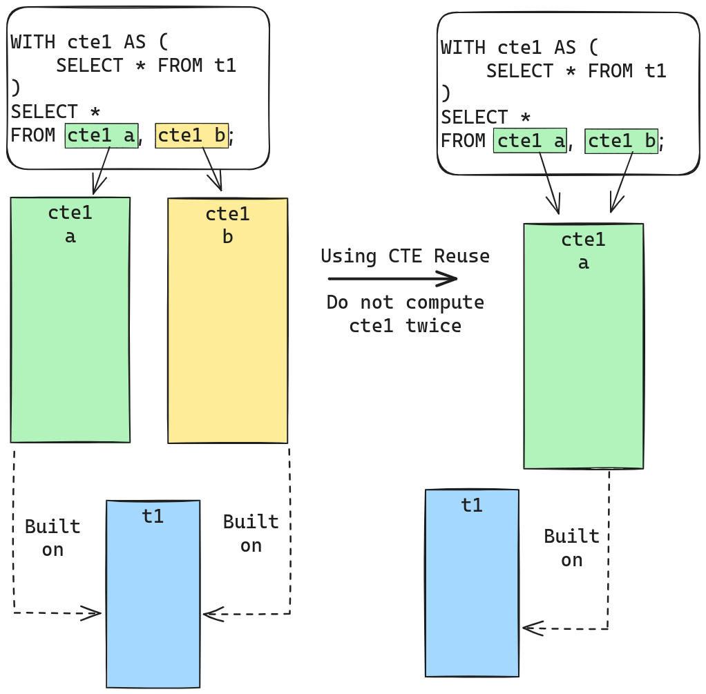
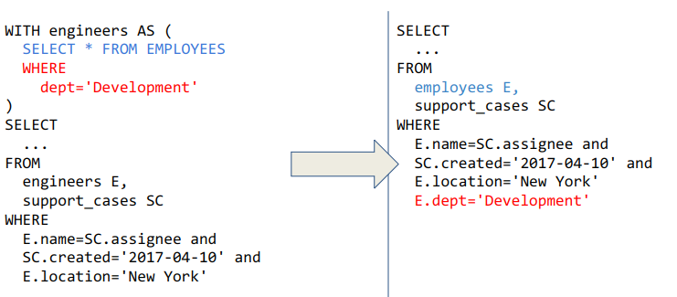
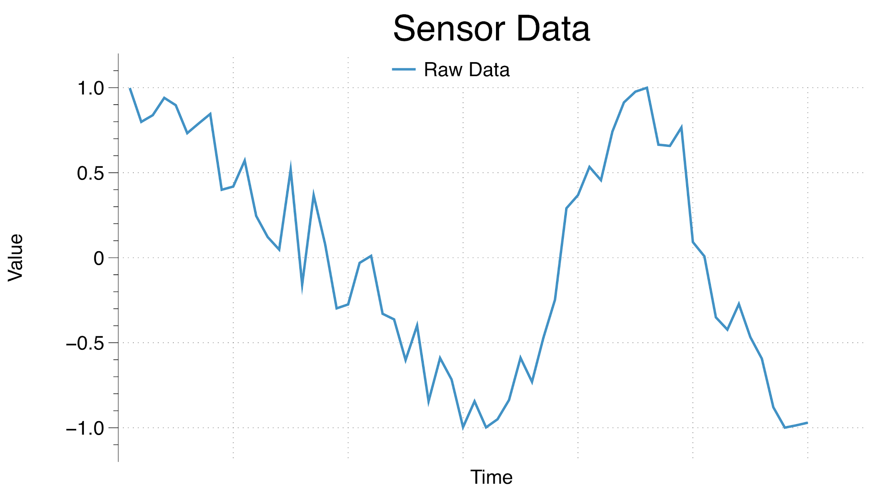
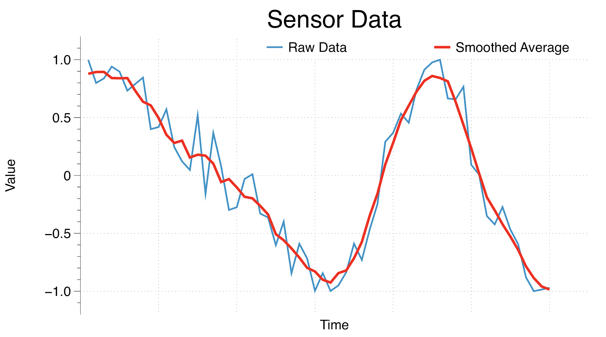
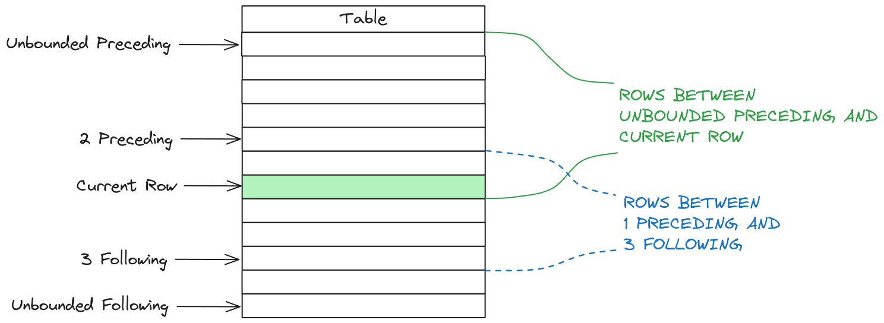

# CTEs

## What is a Common Table Expression?
> A Common Table Expression (CTE) is a modern SQL feature used to define a
> temporary result set. Conceptually CTEs can also be considered query-level views or
> query-level temporary tables, allowing you to define a transient set of results that
> can be used within a larger query.
>
> CTEs primarily serve to simplify complex SQL queries. They can effectively replace nested subqueries, enhancing redability and often improving performance by enabling special CTE specific optimizations for the database's query optimizer.


## Understanding CTE basic syntax
A Common Table Expression starts with the keyword `WITH`, then followed by the CTE name, then `AS`. Following `AS` we have the CTE definition or **CTE Body**.

Here is the general syntax, as implemented in MariaDB.
```sql
WITH [ RECURSIVE ] table_reference [ (columns_list) ] AS (
  SELECT ...
)
[ CYCLE cycle_column_list RESTRICT ]
SELECT ...
```

We'll go into details about the optional keywords, but first let's have a look at the basic case.

### Basic example
Consider the following SQL statement:
```sql
WITH engineers AS (                   # This line defines a CTE named "engineers"
  SELECT name, title, salary          ###########
  FROM employees                      ## CTE Body
  WHERE dept = 'Engineering'          ###########
)
SELECT *
FROM engineers                        # Here we are referencing the "engineers" CTE
WHERE engineers.salary > 1000
```
In this example, we define a CTE called `engineers`, consisting of all employees from the "Engineering" department.
The main `SELECT` statement uses this CTE to filter and retrieve only the engineers earning over 1000.

The equivalent query using traditional SQL, namely subqueries, would be:
```sql
SELECT *
FROM (
  SELECT name, title, salary
  FROM employees
  WHERE dept = 'Engineering'
) AS engineers
WHERE engineers.salary > 1000
```


## Advantages of CTEs in Complex Queries
### Enhanced Readability
Complex SQL queries with multiple nested subqueries can be challenging to interpret as they often require starting from the innermost subqueries and working outwards. This becomes more convoluted with deeper nesting. CTEs, by contrast, offer a more linear and readable structure. Consider the following comparisons:

**Using subqueries**
```sql
SELECT *
FROM (SELECT *
      FROM (SELECT *
            FROM employees
            WHERE dept=”Engineering”) AS engineers                     # Subquery 1
      WHERE engineers.country IN (”NL”, "DE", "FR")) as eu_engineers   # Subquery 2
WHERE ...
```
**Using CTEs**
```sql
WITH engineers AS (                          # First CTE
     SELECT *
     FROM employees
     WHERE dept=”Engineering”
),
eu_engineers AS (                            # Second CTE referencing the first CTE "engineers"
     SELECT *
     FROM engineers
     WHERE country IN (”NL”,...)    
)
SELECT *
FROM eu_engineers
WHERE …
```

Imagine how much more complex this code becomes if those queries get nested a few more level deep.

### Avoiding Repetition
CTEs shine in scenarios where parts of a query need to be reused. Once defined, they are available anywhere within the follow up parts of the query. Consider the case when a query requires a join of the same table twice. If that table is part of a subquery, the subquery must be written twice, or factored out in a VIEW / TEMPORARY TABLE.

**Total sales per year**
Imagine a case where we have to compute the *total volume of sales per product per year". If we had a sales table of the form:
```sql
CREATE TABLE item_sales (product varchar(100), sale_date datetime, price decimal(10, 2));
```
The query would look something like:
```sql
SELECT
    product,
    year(sale_date) as sale_year,
    sum(price)
FROM
    item_sales
GROUP BY
    product, sale_year
```

Now imagine you want to get all the products whose total sales volume has increased since the previous year! With subqueries we'd have to copy paste our query twice and do a join like so:

```sql
SELECT                                    # Table header
    CUR.product,
    CUR.total_amount,
    CUR.sale_year,
    PREV.total_amount,
    PREV.sale_year
FROM
    ( # First subquery defining CUR table for the "current year's sales"
      SELECT                              
          product,
          year(sale_date) as sale_year,
          sum(price) as total_amount
      FROM
          item_sales
      GROUP BY
          product, sale_year) as CUR
      JOIN (  # Second subquery, defining PREV table for the "previous year's sales", same code
          SELECT                             
              product,
              year(sale_date) as sale_year,
              sum(price) as total_amount
          FROM
              item_sales
          GROUP BY
              product, sale_year) as PREV
          ON (  # The join condition between these two tables.
              CUR.product = PREVIOUS.product AND
              CUR.year = PREVIOUS.year + 1
          )
WHERE
    # The filtering condition on which products we are interested in.
    CURRENT.total_amount > PREVIOUS.total_amount
ORDER BY
    CURRENT.product, CURRENT.sale_year
```

Compare this with its CTE equivalent:
```sql
WITH sales_product_year (product, sale_year, total_amount) AS (
    # CTE Body, defined only once.
    SELECT
        product,
        year(sale_date) as sale_year,
        sum(price) as total_amount
    FROM
        item_sales
    GROUP BY
        product, sale_year
)
SELECT 
    CUR.product,
    CUR.total_amount,
    CUR.sale_year,
    PREV.total_amount,
    PREV.sale_year
FROM
    sales_product_year as CUR        # First CTE reference
    JOIN sales_product_year as PREV  # Second CTE reference
    ON (  # The join condition between these two tables.
        CUR.product = PREV.product AND
        CUR.year = PREV.year + 1
    )
WHERE
    # The filtering condition on which products we are interested in.
    CUR.total_amount > PREV.total_amount
ORDER BY
    CUR.product, CUR.sale_year
```

The query using a CTE only has to define the sales_product_year table once. This also has other benefits, in that the Query Optimizer can now properly see the intent of the programmer: self-join two identical tables. This opens up optimization possibilities such as CTE reuse, which we'll cover in a follow-up chapter.

## CTE Execution
Now that we understand what a CTE is and what it's useful for, it's time to look at how the database computes queries that use CTEs. While the next chapter is not essential for making use of CTEs, understanding what optimizations the database engine can do will help you write better performing queries.  

Without considering any query optimizations, conceptually, the database creates a temporary table for each CTE reference. When the query starts, the database goes through the following steps:
1. Identifies all CTE declarations.
2. Identifies all references of CTEs within the query.
3. For each CTE referenced within the query, the database computes the results of its CTE body select. Note that this works when CTEs reference other CTEs. The database starts with the CTEs that have no other CTEs references first.

When writing queries, you can rely on this computation model as it is generally valid. However, an astute reader may observe the potential for plenty of optimizations. There are different strategies the query optimizer can employ, which is what we'll cover next:

## CTE Optimizations

### CTE reuse

The computation model presented above means that if a CTE is referenced multiple times, it has to be computed multiple times. This is obviously inneficient if we can reuse the data.

The following figure shows the "naive" execution compared to reusing CTEs.


With the naive execution plan, the green (cte1 a) and yellow (cte1 b) are identical and get computed twice. The alternative execution plan only computes cte1 once, then the two references use the same storage to execute the query.

**Advantages**
* Easy to implement within the database engine
* Computation work is not duplicated.
* Can speed up query execution

**Disadvantages**
* Chosing CTE reuse as an optimization prevents other optimizations.
* Often there are better strategies to reduce the amount of rows that need to be computed.

### CTE merging
CTEs are very similar to subqueries behind the scenes. A subquery is used to define a query level temporary table, also called a DERIVED TABLE. For certain queries, the optimizer is able to rewrite them by *merging* where clauses together to allow for more filtering conditions to apply sooner. The same rules apply to CTEs as well.

The following figure shows the transformation that the optimizer will do:



This optimization is called CTE Merging

The optimizer knows to optimize derived tables by rewriting the query whenever possible. By doing merging, the following optimization steps have a more straightforward view of the query. This allows the JOIN optimizer (the optimization step deciding on the JOIN order of tables) to make a better cost-based decision. In almost all cases, CTE merging provides a performance speedup, hence the optimizer in MariaDB will always attempt to do merging before any other optimization steps. 

### CTE condition pushdown
There are cases when CTE merging is not possible, because it would change the end outcome of the query. Here is an example:
```sql
WITH sales_per_year AS (
  SELECT
    year(order.date) AS year
    sum(order.amount) AS sales
  FROM
    order
  GROUP BY  -- !!! Group by is present in the CTE !!!
    year
)
SELECT * 
FROM sales_per_year 
WHERE 
  year in ('2015','2016')
```

In the general case, any GROUP BY clause in a CTE prevents direct merging. However there is still a way to optimize the query by identifying any filtering clauses refering to the GROUP BY expression. The key here is the filtering condition:
```sql
WHERE
  year in ('2015', '2016')
```
Instead of computing all groups in the CTE, storing them in a temporary table and only then identifying the groups `2015` and `2016`, one can begin filtering the `order` table directly.
The resulting query, as executed by the optimizer is:
```sql
WITH sales_per_year AS (
  SELECT
    year(order.date) AS year
    sum(order.amount) AS sales
  FROM
    order
  WHERE  -- Where clause is now added to the CTE
    order.year in ('2015', '2016')
  GROUP BY  
    year
)
SELECT * 
FROM sales_per_year 
```

## Recursive CTEs
The previous chapters dealt with the execution of regular CTEs. Now it is time to introduce a more advanced concept for CTEs, *recursion*. With recursive CTEs, one can define complex semantics to compute almost anything. The most common use case however is graph traversal. Let's start with the basic syntax:

```sql
WITH RECURSIVE <cte-name> as (
  <base-select>
  union
  <recursive-select>
)
```

You will notice the extra `RECURSIVE` keyword. A recursive CTE is split into a union of two clauses, a "base" case, defining the initial dataset, then a recursive generator. The recursive generator will execute for as long as new rows can be generated based on the results of the previous iteration. This is harder to explain in plain text, so the following animation will show how a CTE is constructed. 

TODO: video

This covers all the topics related to Common Table Expressions. Next we will dive into another advanced SQL feature, that works well in conjuction with what we've learned so far.

## Window Functions
Window functions are a special kind of SQL function. Window functions can be used in regular SELECT queries and they have the following two particularities:
1. They behave as regular SQL functions, they return one result per row.
2. They behave also like aggregate functions such as `MIN`, `MAX`, `AVG`. The result of window functions is computed over multiple rows. In fact, most aggregate functions can be used as window functions too!

### Syntax

```yaml
<function-name>(<expression>) OVER (
  [PARTITION BY <expression_list>]
  [ORDER BY <order_list> [frame_clause]])

expression_list:
  {expression | column_name} [, expression_list]

order_list:
  {expression | column_name} [ASC | DESC] [, order_list]

frame_clause:
  { ROWS | RANGE } {frame_border | BETWEEN frame_border AND frame_border}

frame_border:
    UNBOUNDED PRECEDING
  | UNBOUNDED FOLLOWING
  | CURRENT ROW
  | expression PRECEDING
  | expression FOLLOWING
```

Let's go through the syntax, one step at a time:
1. The `OVER ()` clause is the bare minimum required to define a window function. This tells the SQL engine that this function will produce one result per row, but that its values will be computed over potentially many different rows. If the used function was traditionally a regular aggregate function, such as `SUM` or `COUNT`, it will now behave as a window function. It will not collapse group rows into a single result.
2. Inside the `OVER` clause one can add modifiers that impact what rows will be used to compute the window function's result. The rows used to compute a window function result are part of the "window frame". The modifiers affect the rows that are part of the "window frame". They are: `PARTITION BY` and `ORDER BY`. We'll go into more concrete examples for each.
3. Finally, one can specify how big the window frame is, in relation to the current row we are computing the window function result for. This is done via the `frame_clause` part of the grammar.

### Dedicated window function use case, row_number()
The best way to understand window functions is to see them in action. We'll start with a dedicated window function, `row_number()`. That means that this function can not be used without the OVER clause (unlike some other SQL functions). We'll also be able to see how PARTITION BY and ORDER BY affect the result.

First, we'll use `row_number()` without any extra arguments in the `OVER` clause.
For this example, we'll be using the ["employees"](employees|https://github.com/datacharmer/test_db) dataset.
Here is the definition of the table we'll be using:

```sql
 MariaDB [employees]> describe employees;
+------------+---------------+------+-----+---------+-------+
| Field      | Type          | Null | Key | Default | Extra |
+------------+---------------+------+-----+---------+-------+
| emp_no     | int(11)       | NO   | PRI | NULL    |       |
| birth_date | date          | NO   |     | NULL    |       |
| first_name | varchar(14)   | NO   |     | NULL    |       |
| last_name  | varchar(16)   | NO   |     | NULL    |       |
| gender     | enum('M','F') | NO   |     | NULL    |       |
| hire_date  | date          | NO   |     | NULL    |       |
+------------+---------------+------+-----+---------+-------+
6 rows in set (0.000 sec)
```

Let's first get the 10 most recently hired employees.
```sql
MariaDB [employees]>
SELECT first_name, last_name, hire_date, birth_date
FROM employees
ORDER BY birth_date desc
LIMIT 10;

+------------+------------+------------+------------+
| first_name | last_name  | hire_date  | birth_date |
+------------+------------+------------+------------+
| Bikash     | Covnot     | 2000-01-28 | 1964-06-12 |
| Yucai      | Gerlach    | 2000-01-23 | 1957-05-09 |
| Hideyuki   | Delgrande  | 2000-01-22 | 1954-05-06 |
| Volkmar    | Perko      | 2000-01-13 | 1959-08-07 |
| Ulf        | Flexer     | 2000-01-12 | 1960-09-09 |
| Jaana      | Verspoor   | 2000-01-11 | 1953-04-09 |
| Shahab     | Demeyer    | 2000-01-08 | 1954-11-17 |
| Ennio      | Alblas     | 2000-01-06 | 1960-09-12 |
| Xuejun     | Benzmuller | 2000-01-04 | 1958-06-10 |
| Jeong      | Boreale    | 2000-01-03 | 1953-04-27 |
+------------+------------+------------+------------+
```

Now our first task, let's create an increasing sequence ID for these employees. Let's try row_number() without any arguments in the OVER clause.
```sql
MariaDB [employees]>
SELECT
row_number() over (),  -- This is our window function.
first_name, last_name, hire_date, birth_date
FROM employees
ORDER BY hire_date DESC
LIMIT 10;
+----------------------+------------+------------+------------+------------+
| row_number() over () | first_name | last_name  | hire_date  | birth_date |
+----------------------+------------+------------+------------+------------+
|               263832 | Bikash     | Covnot     | 2000-01-28 | 1964-06-12 |
|               228402 | Yucai      | Gerlach    | 2000-01-23 | 1957-05-09 |
|               299578 | Hideyuki   | Delgrande  | 2000-01-22 | 1954-05-06 |
|               122990 | Volkmar    | Perko      | 2000-01-13 | 1959-08-07 |
|                37291 | Ulf        | Flexer     | 2000-01-12 | 1960-09-09 |
|               223015 | Jaana      | Verspoor   | 2000-01-11 | 1953-04-09 |
|               127569 | Shahab     | Demeyer    | 2000-01-08 | 1954-11-17 |
|               105073 | Ennio      | Alblas     | 2000-01-06 | 1960-09-12 |
|               126658 | Xuejun     | Benzmuller | 2000-01-04 | 1958-06-10 |
|               224470 | Jeong      | Boreale    | 2000-01-03 | 1953-04-27 |
+----------------------+------------+------------+------------+------------+
```

Well... this is not quite what we might expect. But the results are correct for the query we've given. The reason for the seeming random `row_number` values is: The function always returns a sequence of numbers, 1, 2, 3... and so on. Let's try this on a smaller table first:

#### When are window functions computated?

```sql
MariaDB [employees]> create table tmp (a char);
Query OK, 0 rows affected (0.064 sec)
MariaDB [employees]> insert into tmp (a) values ('d'), ('a'), ('b'), ('c'), ('e');
Query OK, 5 rows affected (0.015 sec)
Records: 5  Duplicates: 0  Warnings: 0
MariaDB [employees]> select row_number() over (), a from tmp;
+----------------------+------+
| row_number() over () | a    |
+----------------------+------+
|                    1 | c    |
|                    2 | e    |
|                    3 | d    |
|                    4 | a    |
|                    5 | b    |
+----------------------+------+
5 rows in set (0.000 sec)
```
Ok, so we see that `row_number()` returns an increasing sequence. Now... let's `order by a`.
```sql
MariaDB [employees]> select row_number() over (), a from tmp order by a;
+----------------------+------+
| row_number() over () | a    |
+----------------------+------+
|                    4 | a    |
|                    5 | b    |
|                    1 | c    |
|                    3 | d    |
|                    2 | e    |
+----------------------+------+
```

Now you can see that `row_number`'s values depend on the order the functions gets to see the rows. This introduces one **key** point for window functions. They are computed after **all other clauses, WHERE, GROUP BY, HAVING**, except for **ORDER BY** and **LIMIT**.

If we wanted to get numbers starting with 1 for 'a', 2 for 'b', 3 for 'c' and so on, we need tell `row_number` what is the order of rows it should be evaluated on.

This is where `ORDER BY` inside the `OVER` clause comes in. We'll change our function like so:
`row_number() over (order by a)`

```sql
MariaDB [employees]> select row_number() over (order by a), a from tmp order by a;
+--------------------------------+------+
| row_number() over (order by a) | a    |
+--------------------------------+------+
|                              1 | a    |
|                              2 | b    |
|                              3 | c    |
|                              4 | d    |
|                              5 | e    |
+--------------------------------+------+
5 rows in set (0.000 sec)
```

Now, that's more like it! Armed with this knowledge, we can fix our employees query too.

```sql
MariaDB [employees]>
SELECT
row_number() over (order by hire_date desc) as row_num,  -- This is our window function.
first_name, last_name, hire_date, birth_date
FROM employees
ORDER BY hire_date DESC
LIMIT 10;
+---------+------------+------------+------------+------------+
| row_num | first_name | last_name  | hire_date  | birth_date |
+---------+------------+------------+------------+------------+
|       1 | Bikash     | Covnot     | 2000-01-28 | 1964-06-12 |
|       2 | Yucai      | Gerlach    | 2000-01-23 | 1957-05-09 |
|       3 | Hideyuki   | Delgrande  | 2000-01-22 | 1954-05-06 |
|       4 | Volkmar    | Perko      | 2000-01-13 | 1959-08-07 |
|       5 | Ulf        | Flexer     | 2000-01-12 | 1960-09-09 |
|       6 | Jaana      | Verspoor   | 2000-01-11 | 1953-04-09 |
|       7 | Shahab     | Demeyer    | 2000-01-08 | 1954-11-17 |
|       8 | Ennio      | Alblas     | 2000-01-06 | 1960-09-12 |
|       9 | Xuejun     | Benzmuller | 2000-01-04 | 1958-06-10 |
|      10 | Jeong      | Boreale    | 2000-01-03 | 1953-04-27 |
+---------+------------+------------+------------+------------+
```

And now we have a continuously increasing number.

#### PARTITIONING rows for window functions

Let's expand our employees query a bit and also use the `gender` column.

```sql
MariaDB [employees]>
  SELECT
    row_number () over (order by e.hire_date desc) as row_num,
    e.first_name, e.last_name, e.hire_date, e.birth_date, e.gender
  FROM employees e
  ORDER BY e.hire_date desc limit 10;
+---------+------------+------------+------------+------------+--------+
| row_num | first_name | last_name  | hire_date  | birth_date | gender |
+---------+------------+------------+------------+------------+--------+
|       1 | Bikash     | Covnot     | 2000-01-28 | 1964-06-12 | M      |
|       2 | Yucai      | Gerlach    | 2000-01-23 | 1957-05-09 | M      |
|       3 | Hideyuki   | Delgrande  | 2000-01-22 | 1954-05-06 | F      |
|       4 | Volkmar    | Perko      | 2000-01-13 | 1959-08-07 | F      |
|       5 | Ulf        | Flexer     | 2000-01-12 | 1960-09-09 | M      |
|       6 | Jaana      | Verspoor   | 2000-01-11 | 1953-04-09 | F      |
|       7 | Shahab     | Demeyer    | 2000-01-08 | 1954-11-17 | M      |
|       8 | Ennio      | Alblas     | 2000-01-06 | 1960-09-12 | F      |
|       9 | Xuejun     | Benzmuller | 2000-01-04 | 1958-06-10 | F      |
|      10 | Jeong      | Boreale    | 2000-01-03 | 1953-04-27 | M      |
+---------+------------+------------+------------+------------+--------+
```

What if we wanted more than one sequence, one for `M` gender, one for `F` gender and one for when when gender is unspecified?

This is where PARTITION BY comes in. If we use `PARTITION BY` inside the `OVER` clause, we create a separate sequence for each different gender. This is very simillar to how `GROUP BY` works in a normal setting.

```sql
MariaDB [employees]>
  SELECT
    row_number () over (partition by e.gender order by e.hire_date desc) as row_num,
    e.first_name, e.last_name, e.hire_date, e.birth_date, e.gender
  FROM employees e
  ORDER BY e.hire_date desc limit 10;
+---------+------------+------------+------------+------------+--------+
| row_num | first_name | last_name  | hire_date  | birth_date | gender |
+---------+------------+------------+------------+------------+--------+
|       1 | Bikash     | Covnot     | 2000-01-28 | 1964-06-12 | M      |
|       2 | Yucai      | Gerlach    | 2000-01-23 | 1957-05-09 | M      |
|       1 | Hideyuki   | Delgrande  | 2000-01-22 | 1954-05-06 | F      |
|       2 | Volkmar    | Perko      | 2000-01-13 | 1959-08-07 | F      |
|       3 | Ulf        | Flexer     | 2000-01-12 | 1960-09-09 | M      |
|       3 | Jaana      | Verspoor   | 2000-01-11 | 1953-04-09 | F      |
|       4 | Shahab     | Demeyer    | 2000-01-08 | 1954-11-17 | M      |
|       4 | Ennio      | Alblas     | 2000-01-06 | 1960-09-12 | F      |
|       5 | Xuejun     | Benzmuller | 2000-01-04 | 1958-06-10 | F      |
|       5 | Jeong      | Boreale    | 2000-01-03 | 1953-04-27 | M      |
+---------+------------+------------+------------+------------+--------+
```

Now this is a bit hard to read. For readability, we can wrap this query in a CTE, then order by gender and row_num.
```sql
MariaDB [employees]>
  WITH emp_row_num as (
    SELECT
      row_number () over (partition by e.gender order by e.hire_date desc) as row_num,
      e.first_name, e.last_name, e.hire_date, e.birth_date, e.gender
    FROM employees e
    ORDER BY e.hire_date desc limit 10)
  SELECT *
  FROM emp_row_num
  ORDER BY gender, row_num;
+---------+------------+------------+------------+------------+--------+
| row_num | first_name | last_name  | hire_date  | birth_date | gender |
+---------+------------+------------+------------+------------+--------+
|       1 | Bikash     | Covnot     | 2000-01-28 | 1964-06-12 | M      |
|       2 | Yucai      | Gerlach    | 2000-01-23 | 1957-05-09 | M      |
|       3 | Ulf        | Flexer     | 2000-01-12 | 1960-09-09 | M      |
|       4 | Shahab     | Demeyer    | 2000-01-08 | 1954-11-17 | M      |
|       5 | Jeong      | Boreale    | 2000-01-03 | 1953-04-27 | M      |
|       1 | Hideyuki   | Delgrande  | 2000-01-22 | 1954-05-06 | F      |
|       2 | Volkmar    | Perko      | 2000-01-13 | 1959-08-07 | F      |
|       3 | Jaana      | Verspoor   | 2000-01-11 | 1953-04-09 | F      |
|       4 | Ennio      | Alblas     | 2000-01-06 | 1960-09-12 | F      |
|       5 | Xuejun     | Benzmuller | 2000-01-04 | 1958-06-10 | F      |
+---------+------------+------------+------------+------------+--------+
```

And now we can clearly see how `PARTITION BY` interacts with the result set. We have two separate sequences, one for each different partition of `M` and `F` gender.

There are more dedicated window functions just like `row_number`. Here are a few:
* [RANK](https://mariadb.com/kb/en/rank/)
* [DENSE_RANK](https://mariadb.com/kb/en/dense_rank/)
* [PERCENT_RANK](https://mariadb.com/kb/en/percent_rank/)
* [NTILE](https://mariadb.com/kb/en/ntile/)
* [MEDIAN](https://mariadb.com/kb/en/median/)
* [LEAD](https://mariadb.com/kb/en/lead/)
* [LAG](https://mariadb.com/kb/en/lag/)
* [FIRST_VALUE](https://mariadb.com/kb/en/first_value/)
* [LAST_VALUE](https://mariadb.com/kb/en/last_value/)

### Aggregate functions as window functions
We've had a look at dedicated window functions in the previous chapter. Another use of the `OVER` clause is to make regular aggregate functions like `SUM` and `COUNT` behave like window functions: That is, compute an aggregate over a set of rows related to the current row.
One such use case is for computing a moving average. For example, let's assume we have a sensor that reads temperature data. The sensor might be very sensitive to small variances and thus produces a rather noisy looking graph, like the following:

```sql
SELECT
  time, value as 'Raw data'
FROM data_points
ORDER BY time;
```

The resulting graph looks something like this:


We can smooth out the data by averaging out each value with the three previous ones and the three following ones. This average value needs to be computed for each data point. We can achieve this by using `AVG` as a window function.
```sql
SELECT
  time, value as 'Raw data',
  avg(value) over (ORDER BY time              -- Order all values by time.
                   ROWS BETWEEN 3 PRECEDING   -- Using that order, average 7 values together.
                            AND 3 FOLLOWING)  -- The current value, 3 before it and 3 after it.
FROM data_points
ORDER BY time;
```


Just like we made use of `AVG` as a window function to compute a rolling average, we can make use of `SUM` to compute a rolling total, or a bank statement with the balance before and after each transaction. Generally to make use of aggregates, we need to specify the frame clause to define which rows are part of the aggregation. This is what we'll be discussing next.

### The frame clause
Let's recap what the syntax for the frame clause is:

```yaml
frame_clause:
  { ROWS | RANGE } {frame_border | BETWEEN frame_border AND frame_border}

frame_border:
    UNBOUNDED PRECEDING
  | UNBOUNDED FOLLOWING
  | CURRENT ROW
  | expression PRECEDING
  | expression FOLLOWING
```

The first thing to note is that the frame clause applies for each partition in the set, as defined by the `PARTITION BY` clause. If there is no `PARTITION BY`, then the frame potentially covers all rows in the result set, depending on the `frame_border` clause. 

For now we'll consider the `ROWS` option:

#### ROWS frame border

Rows implies that the frame borders are defined as an offset from the current row.
* `UNBOUNDED PRECEDING` stands for all rows before the current row belonging to this partition.
* `UNBOUNDED FOLLOWING` stands for all rows after the current row belonging to this partition.
* `CURRENT ROW` stands for the current row, *inclusive*.
* `expression PRECEDING` and `expression FOLLOWING` define a numerical offset, either backwards or forwards from the current row. What matters is the numerical value of the expression. For example: `0 PRECEDING` is the same as `CURRENT ROW`, `1 + 1 PRECEDING` means 2 rows before the current row. Similarly, if the expression value is negative, `-1 PRECEDING` is the same as `1 FOLLOWING`.

The following image shows where each `frame_border` falls in relation to the result set for the `ROWS` type.



#### RANGE frame border

While relative row offsets are useful, there are situations when one is not interested in those, but rather defining a window based on the numerical values of rows. This is where the RANGE type frame comes in. 
The range type frame compares values of the columns in the `ORDER BY` clause to determine the offset. That means that a range type frame is invalid without `ORDER BY` in the `OVER` clause.

The database will report this as an error.
```sql
MariaDB [employees]>
select sum(birth_date) over (RANGE
                             BETWEEN UNBOUNDED PRECEDING
                             AND CURRENT ROW)
from employees limit 10;
ERROR 4019 (HY000): RANGE-type frame requires ORDER BY clause with single sort key
```

RANGE is used to define an offset in values.

Let's take the following mock example:
* We have a table of IT incidents.
* Each IT incident is assigned to a particular DAY.
* For each IT incident, we want to know how many IT incidents preceeded it by 3 days.

Here is the table header:
```sql
CREATE TABLE incidents (pk int auto_increment, date int);
```
For simplicity, date will be a number of the form `YYYYMMDD`. Let's add 10 different incidents.

```sql
insert into incidents (incident_date) values
  (20200101),             -- One incident on 1st of January
  (20200102), (20200102), -- Two incidents on 2nd of January
  (20200103),             -- One incident on 3rd of January
  (20200104), (20200104), -- Two incidents on 4th of January 
  (20200108), (20200108), -- No incidents between 5th and 7th. 2 on the 8th of January
  (20200109), (20200109); -- Two incidents on the 9th of January
```

```sql
SELECT pk, incident_date,
       COUNT(*) OVER (ORDER BY incident_date
                      RANGE BETWEEN 3 PRECEDING  -- 3 Days before the current incident date
                      AND 1 PRECEDING)           -- 1 Day before the current incident date
                   AS preceding_incidents
FROM incidents;

+------+---------------+---------------------+
| pk   | incident_date | preceding_incidents |
+------+---------------+---------------------+
|    1 |      20200101 |                   0 |  -- No incidents preceeding 1st of January
|    3 |      20200102 |                   1 |  -- 1 Incident between 1st of January and 1st of January
|    2 |      20200102 |                   1 |  -- again, 1 incident, this is still 2nd of January
|    4 |      20200103 |                   3 |  -- 3 Incidents between 1st of January and 2nd of January
|    5 |      20200104 |                   4 |  -- 4 Incidents between 1st of January and 3rd of January
|    6 |      20200104 |                   4 |  -- same date, still 4 incidents.
|    7 |      20200108 |                   0 |  -- Between 5th and 7th of January there were no incidents
|    8 |      20200108 |                   0 |  -- Same here
|    9 |      20200109 |                   2 |  -- 2 incidents between 6th and 8th of January
|   10 |      20200109 |                   2 |  -- Same here
+------+---------------+---------------------+
```

While MariaDB does not yet support datetime arithmetic in range type frames (see [MDEV-9727](https://jira.mariadb.org/browse/MDEV-9727)), you can use transformations such as UNIX_TIMESTAMP to convert the frames to numerical values.
```sql
SUM(number) OVER (PARTITION BY col1
                  ORDER BY unix_timestamp(date_col) 
                  RANGE BETWEEN 2592000 PRECEDING 
                            AND 2592000 FOLLOWING)
```

### Where can window functions be used
Now that we've covered all functionality related to window functions, we need to talk about limitations. As mentioned previously, Window Functions are computed after all other clauses except for ORDER BY and LIMIT. That means that we can not use any window function in the `WHERE`, `GROUP BY` or `HAVING` clause. In order to filter rows based on window functions we have to make use of a subquery... or, as we've learned previously: CTEs are an excellent alternative to subqueries. You've already seen an example of this in the previous chapter, where we reordered our employee results by gender, then row_num.

Here is another example of how we can get TOP 5 salaries from a company, not including ties:
```sql
WITH top_salaries (
  SELECT salary, dense_rank() over (ORDER by salary)
  FROM salaries
)
SELECT distinct salary
FROM top_salaries
WHERE rank <= 5
```

This marks the end of our "Advanced SQL Features" course. Now is the time for some exercises to put this theory into practice!
